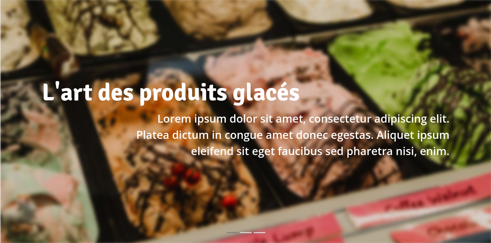

# Projet de site vitrine

Projet réalisé en équipe dans le cadre de ma formation, l'objectif était de réaliser un site vitrine pour une entreprise de vente de produits surgelés et de glaces. Cette dernière, présente en Bretagne et plus largement dans le Grand Ouest, souhaitait améliorer la visibilité de ses produits, sans toutefois proposer de la vente en ligne.

## Résultat

Le dossier `rendu` contient les documents complémentaires que nous avons apportés à chaque étape du projet. Il s'agit :
 - d'une arborescence réalisée sur [Gloomaps](https://www.gloomaps.com/)
 - d'une charte graphique réalisée avec [Canva](https://www.canva.com/)
 - d'une maquette réalisée avec [Figma](https://www.figma.com/)

Le résultat nous aura valu la meilleure note de la promotion.

## Précisions

Le projet, tel que proposé par nos enseignants, devait avant tout nous permettre de maîtriser l'extraction des besoins du client et leur implémentation. Ainsi, seules 4 des pages imaginées nous ont été demandées, qu'il s'agisse du maquettage ou du développement. Les délais imposés ne permettaient par ailleurs pas un travail plus conséquent.

D'autre part, peu de contenu a été rédigé car la seule interview dont nous disposions ne donnait pas assez d'informations pour compléter le site. La majorité des textes sont donc écrits en Lorem Ipsum et laissent prévoir l'espace nécessaire à la rédaction de textes.

## Équipe
 - Noah BROHAN : Chef de projet
 - Enzo MAROS : Développement
 - Alexie GROSBOIS : Graphisme
 - Simon FOUCHET : Extraction des besoins